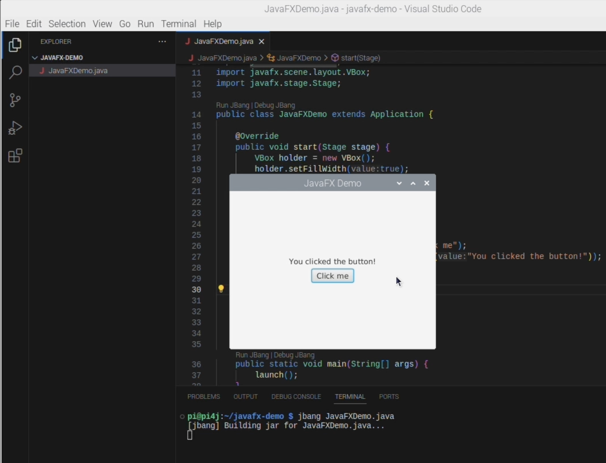

A Raspberry Pi is a Linux computer with a very small size. But this means, we can use all Java and JavaFX features we know from other server and desktop applications. So JavaFX is also your perfect companion to build user interface applications for the Raspberry Pi.

You can follow this tutorial in this video:


## Install JavaFX on Raspberry Pi

Both on Raspberry Pi as on "full size" PC's, JavaFX can be used in two ways: 

* Bundled in the JDK: easiest to install
* As a separate download: allows to use different versions of JDK and JavaFX

### Install Bundled in JDK

The easiest way to install any Java version on a Linux system is [SDKMAN!](https://sdkman.io/). With the following commands you can install SDKMAN! and a JDK with JavaFX:

```shell
$ curl -s "https://get.sdkman.io" | bash 
# Open a new terminal
$ sdk install java 21.0.1.fx-librca

Downloading: java 21.0.1.fx-librca
In progress...
...
Repackaging Java 21.0.1.fx-librca...
Done repackaging...
Installing: java 21.0.1.fx-librca
Do you want java 21.0.1.fx-librca to be set as default? (Y/n): y
Setting java 21.0.1.fx-librca as default.
```

You can now check the installed Java version with:

```java
$ java -version
openjdk version "21.0.1" 2023-10-17 LTS
OpenJDK Runtime Environment (build 21.0.1+12-LTS)
OpenJDK 64-Bit Server VM (build 21.0.1+12-LTS, mixed mode)
```

### Install as Separate Download

[Gluon](https://gluonhq.com/) is the main maintainer of the OpenJFX project and offers commercial support to companies who want to use JavaFX in critical applications. On their website, you can download the latest build of OpenJFX and install it separately from your JDK.

This requires some additional steps compared to the bundled version described before, so we will not go into details for this approach in this tutorial. If you want to know more about this, check the [Pi4J website where a full explanation is available](https://pi4j.com/getting-started/user-interface-with-javafx/).

## Install JBang!

To get started easily, we will not use a full Maven or Gradle project, but a single-file approach using [JBang!](https://www.jbang.dev/).

To install JBang!, we can use the SDKMAN! tool we installed before:

```shell
$ sdk install jbang

Downloading: jbang 0.114.0
In progress...
...
Installing: jbang 0.114.0
Done installing!
Setting jbang 0.114.0 as default.
```

## Install Visual Studio Code

You can edit your Java code directly on the Raspberry Pi with the Text Editor, or install Visual Studio Code like this:

```shell
$ sudo apt update
$ sudo apt install code -y
```

When you have installed Visual Studio Code, start it and add the following extensions to make it a "full Java and JBang IDE":

* "Language Support for Java" by Red Hat
* "JBang support for VS Code Java" by JBang

## Run a Demo Application

Create a new text file with the name `JavaFXDemo.java` in Visual Studio Code with the following content. This is just a quick demo application, check the [Learn JavaFX section of JFX Central](https://www.jfx-central.com/learn-javafx) for more tutorials on how to create a JavaFX Application.

The important part of this code:

* The first line that is needed by JBang.
* The lines starting with `//DEPS` that tell JBang which libraries are needed to run this application.

The rest of the code is just normal Java and JavaFX.

```java
///usr/bin/env jbang "$0" "$@" ; exit $?

//DEPS org.openjfx:javafx-controls:20.0.2
//DEPS org.openjfx:javafx-graphics:20.0.2:${os.detected.jfxname}

import javafx.application.Application;
import javafx.geometry.Pos;
import javafx.scene.control.Button;
import javafx.scene.control.Label;
import javafx.scene.Scene;
import javafx.scene.layout.VBox;
import javafx.stage.Stage;

public class JavaFXDemo extends Application {

    @Override
    public void start(Stage stage) {
        VBox holder = new VBox();
        holder.setFillWidth(true);
        holder.setAlignment(Pos.CENTER);
        holder.setSpacing(5);

        Label label = new Label(); 
        holder.getChildren().add(label);

        Button button = new Button("Click me");
        button.setOnAction(e -> label.setText("You clicked the button!"));
        holder.getChildren().add(button);

        Scene scene = new Scene(holder);
        stage.setTitle("JavaFX Demo");
        stage.setScene(scene);
        stage.show();
    }

    public static void main(String[] args) {
        launch();
    }
}
```

When you have saved this file, it can be started with JBang with the following command:

```shell
$ jbang JavaFXDemo.java 
```

The result will look like this after you've clicked the button:


