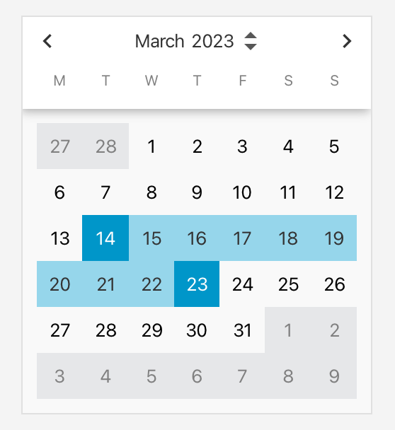
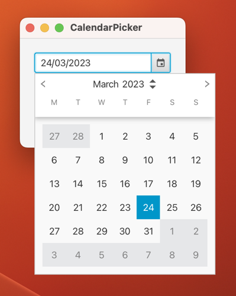
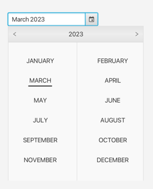
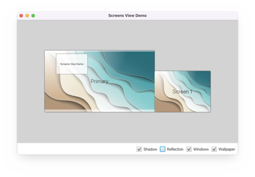
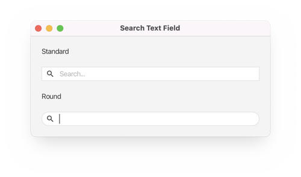
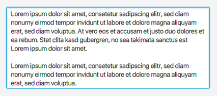
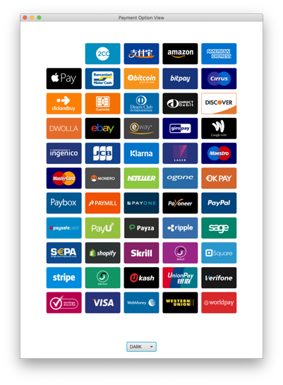
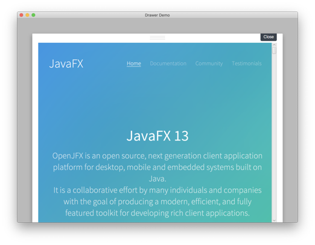

## CalendarView

A nice UI for displaying the month of a year.



## CalendarPicker

A date picker control that uses the calendar view of GemsFX.




## YearMonthPicker

A control for specifying the month of a year (see time API class "YearMonth"). It is very similar to the standard date picker class
and actually inherits a lot of styling attributes from it.



## StripView

A view for horizontally positioning a number of nodes, one for each item added to the view's model. Scroll buttons will
become visible on either side of the view if the available width is not sufficient to show all items / nodes. Scrolling
is animated (can be turned off). The nodes on either side are fading out so that the scroll controls are completely
visible. The view also supports the single selection of an item.


## InfoCenterPane

A view for displaying (groups of) notifications. Incoming / new notifications slide-in via an animation. Each group can have its own factory for the creation of notification views. A group with multiple notifications can be shown stacked or expanded. A threshold can be defined to determine the maximum number of notifications that  can be shown. If the notifcation count is higher than the threshold then the user can switch to a list view showing them all. Groups can be pinned so that they always stay in the top position without being scrolled out of view.


## ScreensView

A small control that can be used to display the screen geometries as seen by the application. The view can also
display the application's windows, and some arbitrary shapes (might be useful for debugging purposes).




## Stage Manager

The `StageManager` class is a utility class that keeps track of a stage's location and dimensions. These values
will be stored and used across user sessions via the `java.util.prefs` API.

## Session Manager

The `SessionManager` class is a utility class that can be used to monitor observables and persist them across user
sessions. This can be useful, for example, for storing and restoring the position of the divider of a SplitPane.

## Search Text Field

A textfield that has been nicely decorated to express that it is used for performing searches.



## Search Field

An auto-suggest text field with a behaviour similar to the spotlight search experience on Mac. While typing the field will automatically finish the entered text if it has a search result where the name starts with the exact typed text. At any time the typed text and the auto-completed text will be visually distinguishable. The field is also capable of creating a new object for the entered text if no result can be found. For detailed instructions [read the WIKI page](https://github.com/dlsc-software-consulting-gmbh/GemsFX/wiki/SearchField).


## Tags Field

An extension of the SearchField control that supports the creation of tags. Selected values are converted into tags when the user hits enter, the right arrow key, or tab. The API of this control allows applications to retrieve the tags, or to monitor the selection state of the tags. The control uses a FlowPane for its layout, which allows the tags to span multiple rows.


## Dialog Pane

The class DialogPane can be used as a layer on top of any application. It offers various methods to display different
types of dialogs.

* Information
* Warning
* Error
* Confirmation
* Node (any UI)
* Busy (spinning animation, indeterminate)
* Single line text input
* Multiple line text input


## Resizable Text Area

A custom control that wraps a text area and adds a resize handle to the lower right corner of it. The area can be configured to be
resizable in vertical, horizontal, or both directions.


## Expanding Text Area

A customized text area that grows based on its text content. The text area will never show vertical or horizontal scrollbars.



## Time Picker

A small control used for entering a time. The control can be configured with a "step rate" for the minutes field (e.g. "15 minutes") that will be used when
incrementing or decrementing the minutes field via the keyboard (arrow keys). The control can also be configured to only allow a time within the time range
defined by an earliest and a latest time. A popup can be used to work with the mouse only. It is also possible to specify whether the fields should "roll over"
or not when they reach their minimum or maximum value. For example: the minute field shows 59 minutes and the user wants to increase it via the arrow key. Then
the new value will be "0" when rollover is enabled. If not the value will remain at 59. Rollover combined with "linking fields" will cause the hours field to
get increased when the minute field rolls over from 59 to 0 or decreased when the minute field rolls over from 0 to 59.


## Duration Picker

A small control used for entering a duration. The control can be configured to only allow a duration within the range
defined by a minimum and maximum duration. A popup can be used to work with the mouse only. It is also possible to specify whether the fields should "roll over"
or not when they reach their minimum or maximum value. The control supports similar features as the time picker: rollover fields, keyboard support, linking fields,
filling fields with leading zeros, etc..


## Photo View

A control for adding and editing a user profile photo (or whatever). The user can click on the control to choose an image file
via a file chooser (replacable) or via drag and drop. Once added the user can move the image around and zoom in / out. As a convenience
the view always provide a cropped version of the original image. This allows applications to store a smaller file on the server / in
the database. The control supports some keyboard shortcuts. The file chooser can be activated by pressing SPACE or ENTER. The photo can
be removed by pressing DELETE or BACK_SPACE.


## Payment Option Controls

A specialized subclass of ImageView that can be used to display different graphics for different payment options. Graphics provided by Gregoire Segretain (https://www.sketchappsources.com/contributor/gregoiresgt)

 

## DrawerStackPane

A stackpane with an optional node that can be shown inside a drawer. The drawer is animated and can slide in and out. When the drawer is showing a semi-transparent glass pane will cover the background. In addition the last height of the drawer can be persisted via the preferences API so that next time the drawer will show itself like in the last user session.



## FilterView

A control for filtering the content of an observable list. Works in combination with TableView, ListView, or any control that is based on observable lists.


## RichTextArea

A read-only text area that is capable of displaying nicely formatted text. The control comes with a rich model and a fluent API that will allow you to quickly compose rich text.


```
RichTextArea area = new RichTextArea();
area.setDocument(
    RTDocument.create(
        RTHeading.create("Heading 1"),
        RTParagraph.create(
            RTText.create("This is the first paragraph. "),
            RTText.create("Some text comes here before the link that "),
            RTLink.create("points to the website ", "https://www.dlsc.com"),
            RTText.create("of DLSC Software & Consulting.")
        ),
        RTParagraph.create(
            RTText.create("Here comes the second paragraph.")
        ),
        RTParagraph.create(),
        RTHeading.create("Heading 2"),
        RTParagraph.create(
            RTText.create("Text for the first paragraph after heading 2."),
            RTList.create(
                RTListItem.create("List item 1"),
                RTListItem.create("List item 2"),
                RTListItem.create("List item 3",
            RTList.create(
                RTListItem.create("Sub item A"),
                RTListItem.create("Sub item B"),
                RTListItem.create("Sub item C"),
                RTListItem.create("Sub item D")
            )
        ),
        RTListItem.create("List item 4")
    )
);
```

## Running the demos

You can run the demos using Maven by typing any of the following lines into your
terminal:

```
mvn javafx:run -f gemsfx-demo/pom.xml -Dmain.class=com.dlsc.gemsfx.demo.DialogsApp
mvn javafx:run -f gemsfx-demo/pom.xml -Dmain.class=com.dlsc.gemsfx.demo.DrawerApp
mvn javafx:run -f gemsfx-demo/pom.xml -Dmain.class=com.dlsc.gemsfx.demo.DurationPickerApp
mvn javafx:run -f gemsfx-demo/pom.xml -Dmain.class=com.dlsc.gemsfx.demo.EmailFieldApp
mvn javafx:run -f gemsfx-demo/pom.xml -Dmain.class=com.dlsc.gemsfx.demo.EnhancedLabelApp
mvn javafx:run -f gemsfx-demo/pom.xml -Dmain.class=com.dlsc.gemsfx.demo.ExpandingTextAreaApp
mvn javafx:run -f gemsfx-demo/pom.xml -Dmain.class=com.dlsc.gemsfx.demo.FilterViewApp
mvn javafx:run -f gemsfx-demo/pom.xml -Dmain.class=com.dlsc.gemsfx.demo.PaymentOptionApp
mvn javafx:run -f gemsfx-demo/pom.xml -Dmain.class=com.dlsc.gemsfx.demo.PaymentOptionTilesApp
mvn javafx:run -f gemsfx-demo/pom.xml -Dmain.class=com.dlsc.gemsfx.demo.PhotoViewApp
mvn javafx:run -f gemsfx-demo/pom.xml -Dmain.class=com.dlsc.gemsfx.demo.ResizableTextAreaApp
mvn javafx:run -f gemsfx-demo/pom.xml -Dmain.class=com.dlsc.gemsfx.demo.RichTextAreaApp
mvn javafx:run -f gemsfx-demo/pom.xml -Dmain.class=com.dlsc.gemsfx.demo.TimePickerApp
```