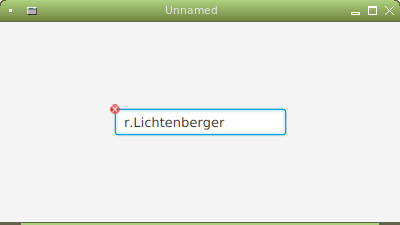

ValidatorFX is a validation library for JavaFX. It is inspired by [ControlsFX](https://github.com/controlsfx/controlsfx) but tries to overcome its shortcomings:
* Validations based on arbitrary observable values (not just the value of a control)
* Validations can decorate an arbitrary number of nodes (not just the one control)
* Validations can decorate any node (not just `Control` subtypes)
* Validations can be done immediately or on-demand (e.g. when clicking a button)

The central class of ValidatorFX is `Validator` which contains a number of `Check`s. As a rule a form will have one `Validator` object and multiple `Check`s.

## Example

Heres a minimal complete example of how ValidatorFX is used:

```java
package net.synedra.validatorfx.demo;

import javafx.application.Application;
import javafx.geometry.Pos;
import javafx.scene.Scene;
import javafx.scene.control.TextField;
import javafx.scene.layout.GridPane;
import javafx.stage.Stage;
import net.synedra.validatorfx.Validator;

public class MinimalExample extends Application {

    private Validator validator = new Validator();

    @Override
    public void start(Stage primaryStage) {
        TextField userTextField = new TextField();

        validator.createCheck()
                .dependsOn("username", userTextField.textProperty())
                .withMethod(c -> {
                    String userName = c.get("username");
                    if (!userName.toLowerCase().equals(userName)) {
                        c.error("Please use only lowercase letters.");
                    }
                })
                .decorates(userTextField)
                .immediate();

        GridPane grid = createGrid();
        grid.add(userTextField, 1, 1);

        Scene scene = new Scene(grid);
        primaryStage.setScene(scene);
        primaryStage.show();
    }

    private GridPane createGrid() {
        GridPane grid = new GridPane();
        grid.setAlignment(Pos.CENTER);
        grid.setPrefSize(400, 200);
        return grid;
    }

    public static void main(String[] args) {
        launch();
    }
}
```

Let's look at the central lines which show the fluent API of ValidatorFX:

```java
validator.createCheck()
```

A new check is created within the validator in this line.

```java    
.dependsOn("username", userTextField.textProperty())
```

A dependency named `username` is declared here. You can call dependsOn multiple times if you have more dependencies.

```java
.withMethod(c -> {
    String userName = c.get("username");
    if (!userName.toLowerCase().equals(userName)) {
        c.error("Please use only lowercase letters.");
    }
})
```

This defines the check to be executed. Note how the dependency declared above can easily be accessed here (of course we could also have used `userTextField.getText()` instead of `c.get("username")` here.

```java
.decorates(userTextField)
```

This line tells ValidatorFX to decorate the text field itself. You can call decorates multiple times if you want multiple nodes to be decorated.

```java
.immediate();
```

The check is declared immediate by this line which means it will be evaluated constantly and `userTextField` will be decorated as soon as the check condition changes. Without this line you can validate on submit.

Here's a screenshot of the example in action:

