_JPAD Modeller_ is a knowledge-based shape modelling tool developed to support aircraft design workflows. The software is a desktop application that provides an efficient 3D geometry pre-processor for several third-party computational environments, which are typically used for aircraft conceptual and preliminary design studies. _JPAD Modeller_ features a UI made with JavaFX and leverages the computational library named _JPAD_ (Java API for Aircraft Design).

**Business model**

The business model of _JPAD Modeller_ is represented by a full-blown parametric model of an entire aircraft, defined within _JPAD_, the underlying API. The aircraft model features several modules that define all the aircraft components (fuselage, wing, empennages, engines, etc). 

The main aircraft data structure collects the high-level parameter (such as the aircraft type, the reference set of regulations, or limit load factor values), keeps a list of all components (such as the fuselage, the wing, tails, etc), specifies the components positions and rotations in a Body Reference Frame (BRF), and points to a number of predefined component definition files. 
Without the detailed definitions of all components the aircraft model is only an empty container capable of linking together empty aircraft parts. By adding or removing additional components the user can customize the aircraft according to his/her needs. Each aircraft component holds the minimum set of parameters needed to fully describe that aircraft part, simplifying the navigation throughout all aircraft data and the modification of the parametric model. 

The same _JPAD Modeller_ aircraft parametric model is also used as a base layer to build up the aircraft CAD model. This is _automatically generated_ starting from the selected set of components and their defining parameters. The CAD model data structure has been designed with a modular approach. The user can decide to generate only one or more of the components that compose the aircraft according to his/her needs.

A parametric aircraft model created with _JPAD Modeller_ may result in a fairly complex CAD artifact. The following CAD entities can be defined: 
- Fuselages with streamlined nose and tail cones.
- Lifting surface layouts with multiple panels.
- Lifting surface tips (flat cut-off, rounded tips).
- Wing tip winglets.
- Wing-fuselage fairings.
- Canard-fuselage fairings.
- Engine Pylons for under-wing-mounted engines, upper-wing-mounted engines and fuselage-mounted engines.
- Propeller disks with spinners.
- Nacelles (different Levels of Detail available).

**User experience**

_JPAD Modeller_ provides a simple and efficient user experience. Starting from the setup of the working directories, up to the export of the final aircraft geometry, the software is designed to minimize the user actions necessary to complete a work session. In addition, automatic aircraft geometry checks combined with a smart management of the possible runtime errors and exceptions, enhance the user experience by highlighting errors causes and by suggesting possible solutions. 

An aircraft in _JPAD Modeller_ is defined by hundreds of parameters, the UI provides several info buttons and prompt messages whenever needed, allowing the user to stay focused on his own project and complete successfully an entire work session. 

The workflow of a typical _JPAD Modeller_ session is the following:
1. Definition of the initial aircraft model,
    - aircraft initialization with a knowledge-based pre-design module, or
    - import of a pre-defined aircraft model, or
    - creation of a design from scratch.
2. Management of the aircraft model and its components (add/remove components, parameters modifications, airfoils and engine deck customizations). 
3. Management of the aircraft CAD model (selecting aircraft components for which CAD generation is required, or advanced CAD features management). 
4. Update the aircraft CAD model. 
5. Export the aircraft or its CAD model.

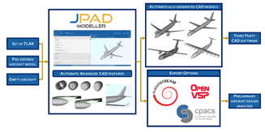

The possibility to import pre-defined components enhances the user experience allowing to easily build up an aircraft model by simply combining different parts. Those parts can be imported either by default aircraft model components or by user-defined components exported during previous work sessions. 

**Setup the working environment**

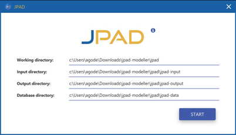

**Choose the Pre-design mode to initialize the aircraft model**

**Load a pre-set of Top Level Aircraft Requirements (TLAR)**

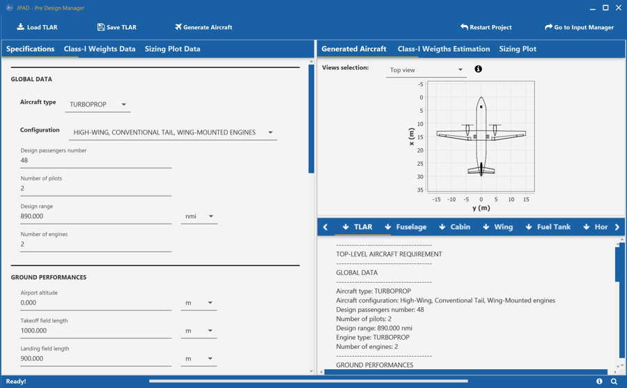

**Two-pane paradigm plus message logs in the RHS-pane**

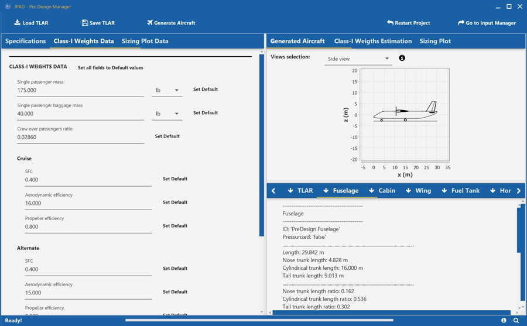

**Class-I weight estimation as an example of knowledge-based design initialization**

**Choose to load a pre-defined design**

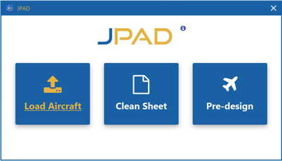

**Two-pane paradigm - LHS: components definition - RHS: 3D and 2D inspection windows**

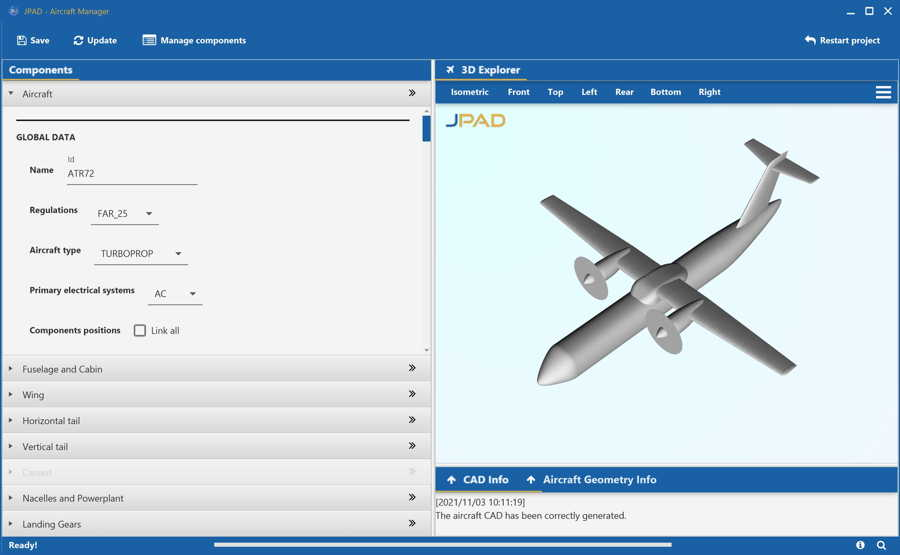

**CAD manager configuration**

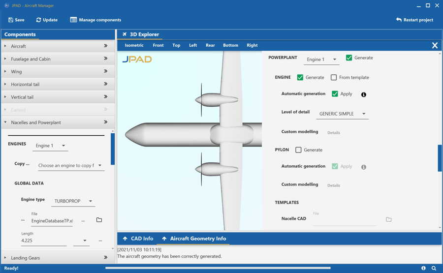

**Component inspection windows (2D) - Wing**

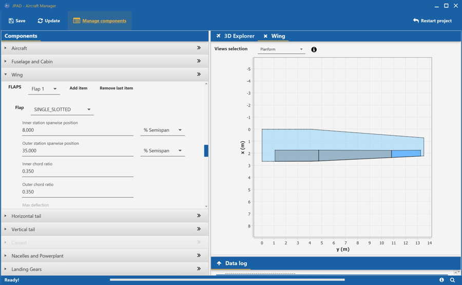

**Component inspection windows (2D) - Fuselage and cabin**

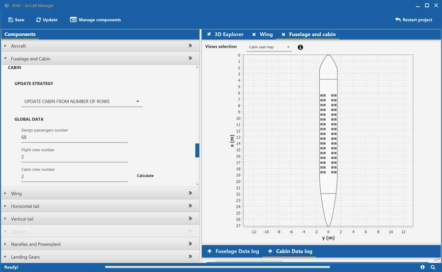

**Component inspection windows (2D) - Landing gears**

**Component inspection windows (2D) - Landing gears**

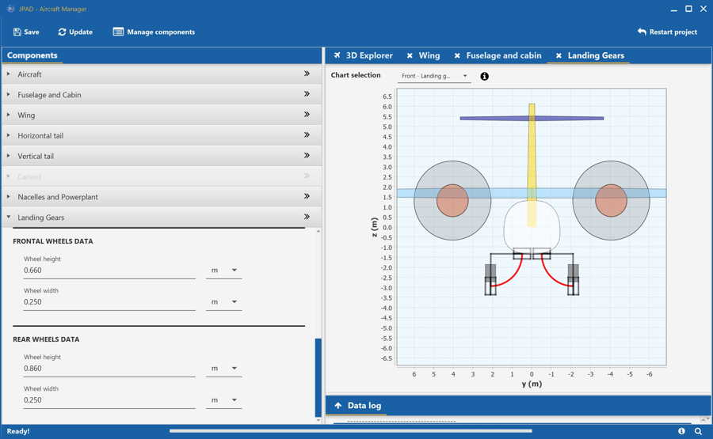

**Airfoil shape management window**

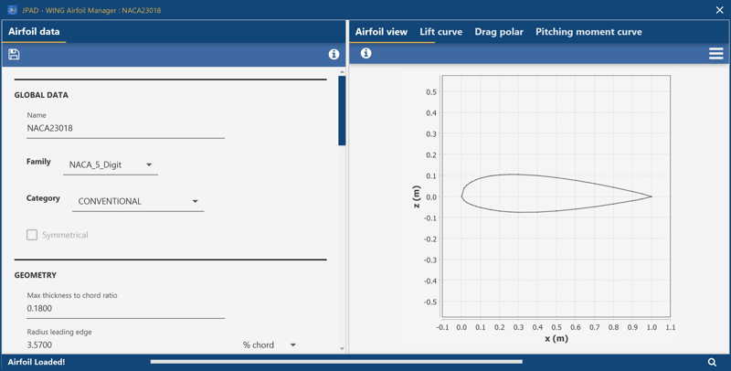

**Airfoil shape management window**

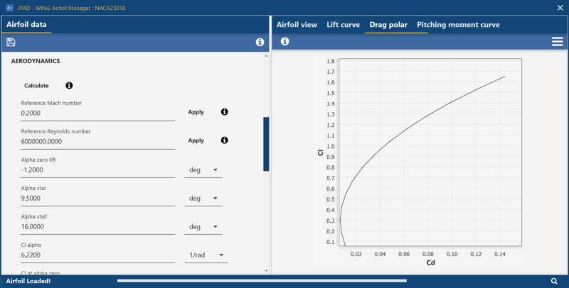

**Aircraft management window and component update strategy**

> _JPAD Modeller_ is developed and released as a Commercial Software by [SmartUp Engineering srl](https://www.smartup-engineering.com). More information and a trial request form are available at [https://www.smartup-engineering.com/jpad-modeller](https://www.smartup-engineering.com/jpad-modeller)

