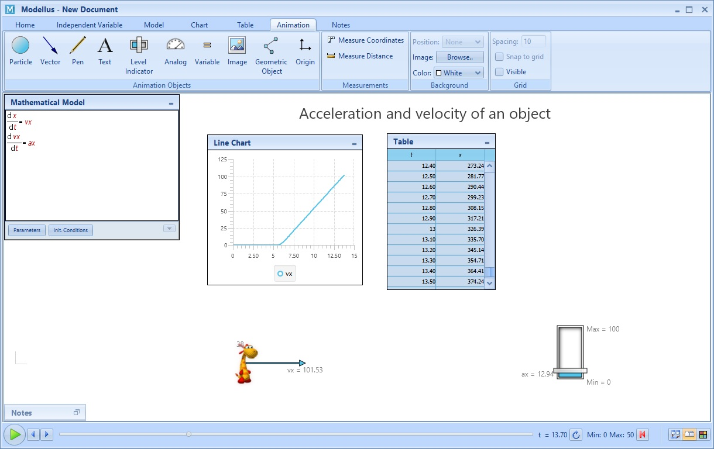

Modellus is a freely available application that enables students and teachers (high school and university) to use 
mathematics to create or explore models interactively.

It has been published in different languages (English, Chinese, Spanish, Portuguese, Greek, etc) and it is used all 
over the world and in several published scientific papers. Samples range from Physics to Mathematics, going through Mechanics, 
Chemistry, Statistics, Algebra, Geometry, among others.

Modellus is currently a Swing application with embedded JavaFX scenes. It was the first application, at least publicly, 
to integrate both Swing and JavaFX together in a single application by using a custom created component JXScene 
– there was no official, supported way to integrate JavaFX in a Swing application at that time.

Modellus is used to introduce computational modeling, allowing an easy and intuitive creation of mathematical models 
using just standard mathematical notation. It allows the creation of animations with interactive objects that 
have mathematical properties expressed in the model, for allowing the exploration of multiple representations and for permitting 
the analysis of experimental data in the form of images, animations, charts and tables. Modellus focuses on modeling and 
on the meaning of models.

Modellux X latest release was in 2012, but it is still being used today.

