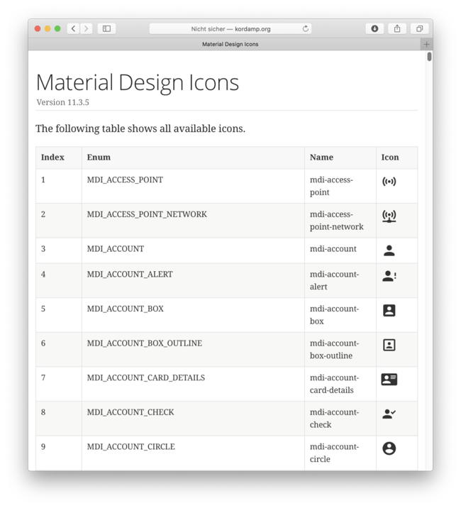
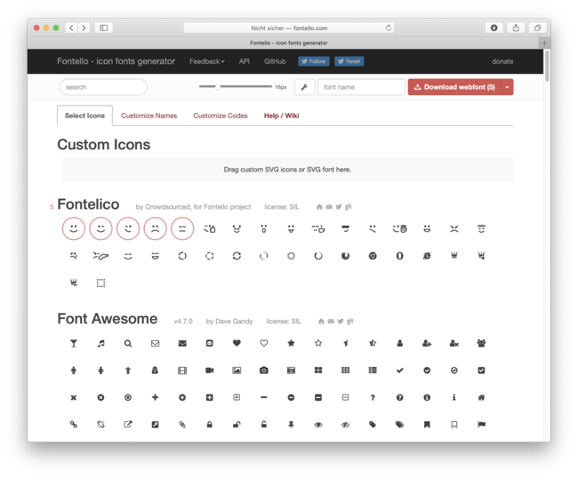
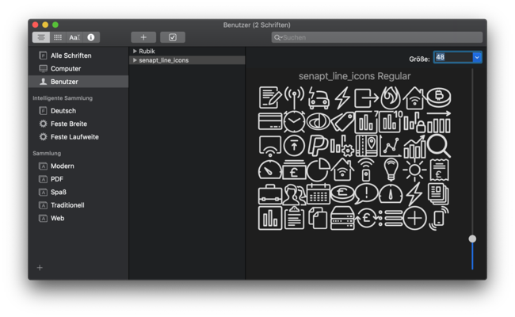

### Motivationx

I have been coding JavaFX applications and libraries since 2013 and one thing they all had in common was 
that I needed to find good icons / graphics that I could use for them. As a former Swing developer I started 
by using image files, GIFs or PNGs. Normally I would license a library like the “O-Collection” from 
IconExperience (www.incors.com). But soon it became apparent to me that using image files is too painful.

Just imagine for a moment that you want to support different pseudo states of your nodes (e.g. “hover”, 
“pressed”, “focused”). You end up with a different version of the same icon for each state. Even more 
files are needed if you want to support different sizes (small, medium, large) or screen resolutions 
(e.g. “Retina Display” on Mac, 2x Icons). Ultimately you end up in image file hell.

At first I didn’t care that much, because I started with framework development. Projects like CalendarFX 
or FlexGanttFX required only a very small number of icons. So using PNG files for these libraries was not 
an issue. But once I started working on bigger projects the need to support hundreds of icons became clear.

### Icon Fonts

Luckily for all of us the web has already come up with a solution for this problem, and the solution is 
called “Icon Fonts”. The big advantage of an icon font is the fact that all icons are contained within a 
single file. That makes managing them in your workspace very easy. The other advantage is that font icons 
can be styled via CSS. This way a single icon can be displayed in many different colors or sizes.

The most popular icon font, at least in the beginning, was FontAwesome and there is a JavaFX implementation 
for it called FontAwesomeFX by Jens Deters. I used this library for all of my projects for a very long time 
and never thought I needed anything else. That was until I stumbled over Andres Almiray’s excellent library 
called “Ikonli”. You can find it on GitHub. After that I used it for all of my JavaFX-related work. For my 
large applications but also for my libraries.

What I like about Ikonli is that it integrates so seamlessly with the existing JavaFX API. An icon is simply
an extension of the “Text” node (duh!) and it comes with styleable properties. There are properties for the 
icon itself, the icon “code”, for its color and for its size. The names of these properties in CSS files also 
follows convention. There they are called -fx-icon-code, -fx-icon-color, and -fx-icon-size.

### Integration

Ikonli does not just ship with FontAwesome but with a total of 31 (!) different fonts. Among them material 
design icons, weather icons, payment icons (credit cards, etc…). Each one of these comes in their own module 
/ artefact and can be imported individually, e.g. via Maven dependencies. The following dependencies need to 
be added to your Maven project’s POM file if you want to use the Material Design icon font.

```xml
<dependencies>
    <dependency>
        <groupId>org.kordamp.ikonli</groupId>
        <artifactId>ikonli-javafx</artifactId>
        <version>11.3.5</version>
    </dependency>
</dependencies>

<dependency>
    <groupId>org.kordamp.ikonli</groupId>
    <artifactId>ikonli-materialdesign-pack</artifactId>
    <version>11.3.5</version>
</dependency>
```

### Cheat Sheets

Icon fonts often come with a lot of icons in them. So finding the right one is hard. Ikonli makes this 
easy by providing a “cheat sheet” for each font. The one for “Material Design” icons can be seen below.



### Coding

Once you have created a FontIcon node / instance you can use it anywhere in the JavaFX scenegraph. 
Below you see an example for setting it on a button via code.

```java
Button button = new Button("User Account");
button.setGraphic(new FontIcon());
button.setId("account-button");
```

To style the icon you add the following to your CSS file:

```css
#account-button .ikonli-font-icon {
    -fx-icon-code: "mdi-account";
    -fx-icon-color: blue;
    -fx-icon-size: 1.2em;
}
```

To use an icon inside an FXML file you can write this:

```xml
<Button text="User Account" id="account-button">
    <graphic>
        <FontIcon iconLiteral="mdi-account"/>
    </graphic>
</Button>
```

### Custom Fonts

You can also create your own custom icon font for JavaFX based on Ikonli. Obviously the first thing 
you will need is the font file. There are several online services available that allow you to create 
such a font. They let you choose icons from various already existing fonts but they also let you 
upload your own SVG files. The one I used is called Fontello. It has three main areas: icon selection 
and / or upload, customize names, customize codes.




Once you have configured your icons properly online you can then download the result as a ZIP file. 
Inside the ZIP file you will find the icon font in various formats.


To verify that all of your icons are actually inside the font you can open the file via “Font Book” 
(on Mac). It should look something like this:



### Icon Enum

To make this font available inside your JavaFX application you have to first implement an enumeration 
with a value for each icon. It will look similar to this:

```java
package com.acme.font;

import org.kordamp.ikonli.Ikon;

public enum MyIcon implements Ikon {

    HOUSE("my-icon-house", '\ue815'),
    CAR("my-icon-car", '\ue816'),
    DOG("my-icon-dog", '\ue817'),
    CAT("my-icon-cat", '\ue818'),
    KID("my-icon-kid", '\ue819');

    private String description;
    private char icon;
 
    MyIcon(String description, char icon) {
        this.description = description;
        this.icon = icon;
    }
 
    public String getDescription() {
        return description;
    }
 
    public int getCode() {
        return icon;
    }
 
    public static MyIcon findByDescription(String description) {
        for (MyIcon icon : values()) {
            if (icon.description.equals(description)) {
                return icon;
            }
        }
        throw new IllegalArgumentException("Icon not supported: " + description);
    }
}
```

### Ikon Handler

The next thing you have to implement is an extension of `AbstractIkonHandler`. For this example where 
all icon literals are prefixed with “my-icon” the “supports” method returns exactly that prefix.

```java
package com.acme.font;
import org.kordamp.ikonli.AbstractIkonHandler;
import org.kordamp.ikonli.Ikon;

public class MyIkonliHandler extends AbstractIkonHandler {

    public boolean supports(String description) {
        return description != null && description.startsWith("my-icon-");
    }
 
    public Ikon resolve(String description) {
        return MyIcon.findByDescription(description);
    }
 
    public String getFontResourcePath() {
        return "com/acme/fonts/my-icons.ttf";
    }
 
    public String getFontFamily() {
        return "my-icons";
    }
}
```

### Service Lookup

Now all that is left to do is to make the font available to the world. This is done via a service lookup, 
which means that you have to create a file called “org.kordamp.ikonli.IkonHandler” inside the folder 
META-INF/services. Inside this file you need to add the full class name of your handler class 
(com.acme.font.MyIkonliHandler).

### Example

The following screenshot shows the font module we use in our Maven project. Your project should look 
similar to that.


