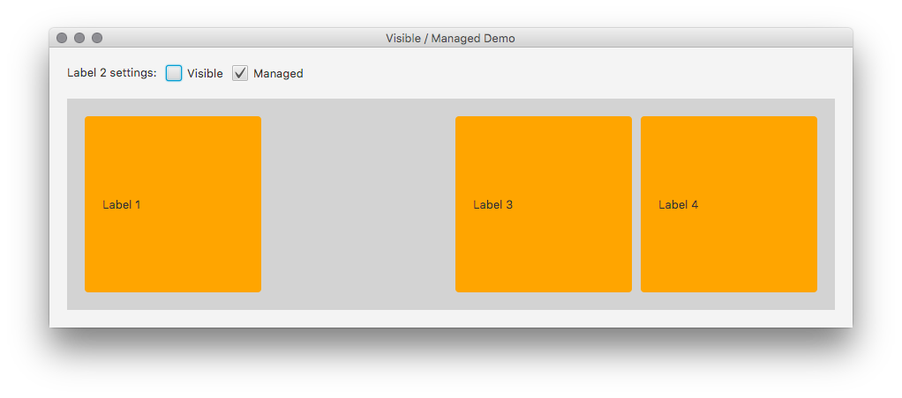
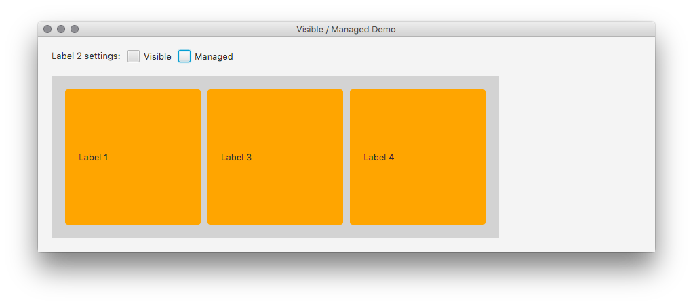

Back in the days when I was still implementing UIs in Swing I used to be a big fan of MigLayout (“one layout manager to rule them all”, right Mikael?). One of the features I really liked was the possibility to define different behaviors when a component became invisible. MigLayout allowed me to either preserve the space that the now invisible component occupied or to make it available for the still visible components. So how can I do this in JavaFX?

Even though the answer is quite simple it is not obvious by looking at the API. JavaFX uses layout panes such as VBox, HBox, BorderPane, FlowPane, or GridPane, to lay out managed children nodes. The keyword here is “managed”. The layout panes only consider those nodes inside their layout algorithms that are flagged as managed (default is true). The same is true for the the code that computes the pref, min, max widths of a pane. This code also only considers managed nodes.

Let’s look at an example. We create an HBox with four labels. Initially it looks like this.


We now set the visibility of label 2 to false and we receive this layout.



To reuse the space that used to be occupied by the label we now set the “managed” property of label 2 to false. As you can see below the remaining three labels are now filling the entire width of the HBox and the width of the HBox was adjusted properly.



Demo code below.

```java
package uk.co.senapt.desktop;

import javafx.application.Application;
import javafx.geometry.Insets;
import javafx.scene.Scene;
import javafx.scene.control.CheckBox;
import javafx.scene.control.Label;
import javafx.scene.layout.HBox;
import javafx.scene.layout.VBox;
import javafx.stage.Stage;

/**
 * A little demo showing how the "visible" and "managed" property can be used
 * to make a node disappear in such a way that the layout pane / container can
 * reclaim the space previously occupied by the now invisible node.
 */
public class VisibleManagedDemo extends Application {

    @Override
    public void start(Stage primaryStage) {

        Label label1 = createLabel("Label 1");
        Label label2 = createLabel("Label 2");
        Label label3 = createLabel("Label 3");
        Label label4 = createLabel("Label 4");

        CheckBox visibleBox = new CheckBox("Visible");
        CheckBox managedBox = new CheckBox("Managed");

        visibleBox.setSelected(true);
        managedBox.setSelected(true);

        label2.visibleProperty().bind(visibleBox.selectedProperty());
        label2.managedProperty().bind(managedBox.selectedProperty());

        HBox hBox1 = new HBox(10, new Label("Label 2 settings:"), visibleBox, managedBox);

        HBox hBox2 = new HBox(10, label1, label2, label3, label4);
        hBox2.setStyle("-fx-background-color: lightgray; -fx-padding: 20");

        VBox vBox = new VBox(20, hBox1, hBox2);
        vBox.setFillWidth(false);
        vBox.setPadding(new Insets(20));

        primaryStage.setTitle("Visible / Managed Demo");
        primaryStage.setScene(new Scene(vBox));
        primaryStage.sizeToScene();
        primaryStage.centerOnScreen();
        primaryStage.show();
    }

    private Label createLabel(String text) {
        Label label = new Label(text);
        label.setStyle("-fx-background-color: orange; -fx-background-radius: 4; -fx-padding: 20;");
        label.setPrefSize(200, 200);
        return label;
    }

    public static void main(String[] args) {
        launch();
    }
}
```