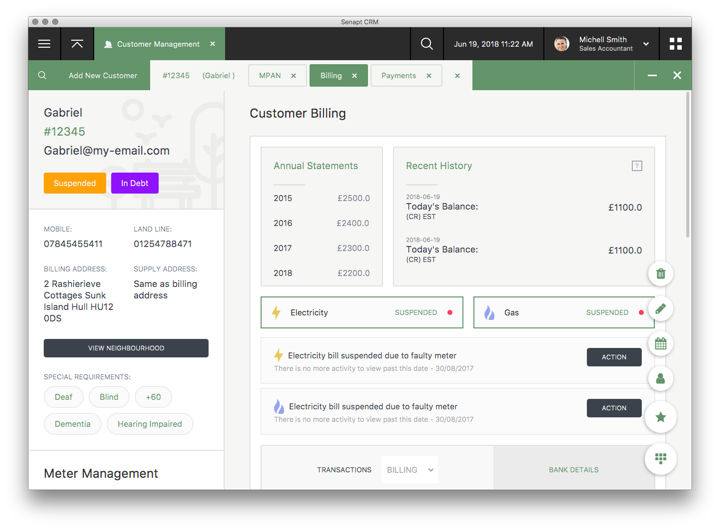
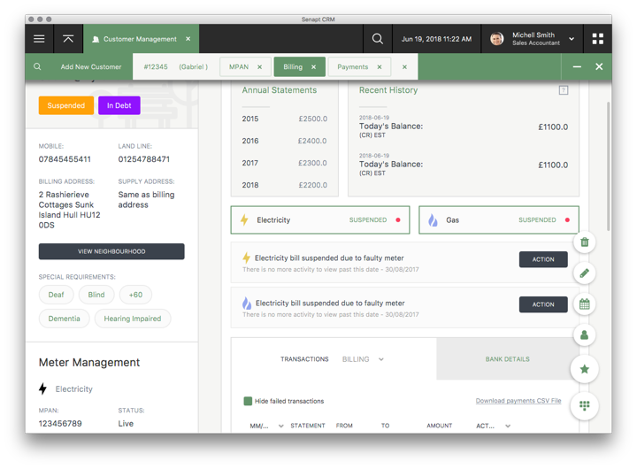

In one of my projects I recently noticed that it was hard for the user to see whether the content of a ScrollPane
instance was currently scrolled or not. One way of making this more clear is to add a drop shadow to the top of the
scroll pane. This is also something suggested by Google’s Material Design. So I gave it a try. In my solution I simply
added a region to the ScrollPane and when laying it out I am moving it out of the viewport bounds of the ScrollPane so
that only the shadow effect applied to the region still reaches into it. To really make sure that the region is not
visible I also had to set a clip on the ScrollPane. This works quite well although I must admit I am not 100% sure this
is the best way to do it. So if anybody has any suggestions / alternativ approaches then please leave a comment.

Below you see before and after scrolling screenshots of one of the screens of our application.

### Before Scrolling



### After Scrolling



BTW: I implemented this in such a way that the drop shadow doesn’t just appear all of a sudden, but it moves into the
viewport step by step, depending on how far the user has scrolled. To see this you need to scroll down very slowly.

The code for the ShadowScrollPane looks like this:

```java
package uk.co.senapt.desktop.shell;

import javafx.beans.property.BooleanProperty;
import javafx.beans.property.SimpleBooleanProperty;
import javafx.geometry.Insets;
import javafx.scene.Node;
import javafx.scene.control.ScrollPane;
import javafx.scene.layout.Region;
import javafx.scene.shape.Rectangle;

public class ShadowScrollPane extends ScrollPane {

    private Region shadow = new Region();

    public ShadowScrollPane() {
        super();

        init();
    }

    public ShadowScrollPane(Node content) {
        super(content);
        init();
    }

    private void init() {
        skinProperty().addListener(it -> getChildren().addAll(shadow));

        setFitToWidth(true);
        setVbarPolicy(ScrollBarPolicy.NEVER);
        setHbarPolicy(ScrollBarPolicy.NEVER);

        shadow.setManaged(false);
        shadow.setStyle("-fx-pref-height: 10;" +
                "-fx-background-color: black;" +
                "-fx-effect: dropshadow(gaussian, rgba(0, 0, 0, .75), 20, 0.19, 0, 6);");
        shadow.getStyleClass().add("shadow");
        shadow.visibleProperty().bind(showShadowProperty());
        shadow.setMouseTransparent(true);
        shadow.visibleProperty().bind(vvalueProperty().greaterThan(0));

        Rectangle clip = new Rectangle();
        clip.widthProperty().bind(widthProperty());
        clip.heightProperty().bind(heightProperty());
        setClip(clip);

        vvalueProperty().addListener(it -> {
            if (lastOffset != computeOffset()) {
                requestLayout();
            }
        });
        showShadowProperty().addListener(it -> requestLayout());
    }

    private final BooleanProperty showShadow = new SimpleBooleanProperty(this, "showShadow", true);

    public final BooleanProperty showShadowProperty() {
        return showShadow;
    }

    public final boolean isShowShadow() {
        return showShadow.get();
    }

    public final void setShowShadow(boolean show) {
        showShadow.set(show);
    }

    private final int SHADOW_HEIGHT = 30;

    @Override
    protected void layoutChildren() {
        super.layoutChildren();

        if (isShowShadow()) {
            Insets insets = getInsets();
            double w = getWidth();
            double offset = computeOffset();
            shadow.resizeRelocate(-10, insets.getTop() - shadow.prefHeight(-1) - SHADOW_HEIGHT + offset, w + 20, shadow.prefHeight(-1) - 1);
            lastOffset = offset;
        }
    }

    private double lastOffset;

    private double computeOffset() {
        if (getContent() != null) {
            return Math.min(getVvalue() * getContent().prefHeight(-1), SHADOW_HEIGHT);
        }

        return 0;
    }
}
```